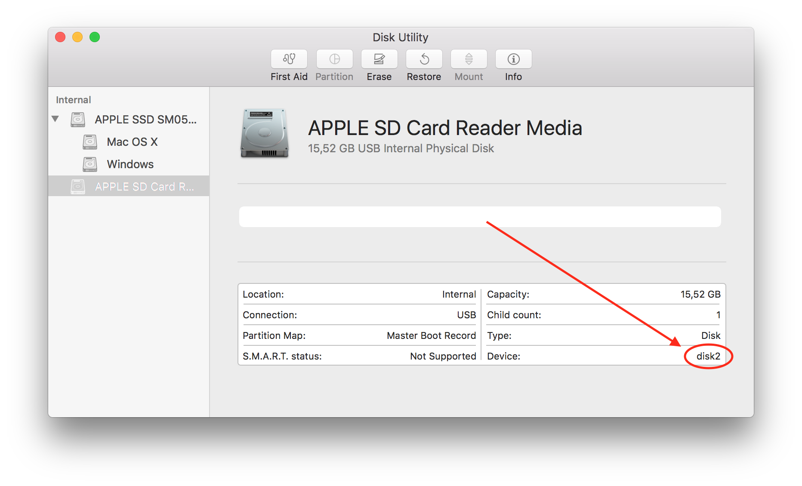

# 6D6 Compatibility Tools

This is a small collection of tools to convert data from the new 6D6 datalogger to other formats.

The main supported format is the MiniSEED format.
It is widely accepted in the seismological community and ensures maximum compatibility with different workflows.

For compatibility with SEND software, the s2x format can be used.
This is especially useful when you are in the process of migrating to the new 6D6 Datalogger but still have a lot of old recorders and wish to use all the models side by side.

As a planned feature, the implementation of the SEG-Y format is in progress.

## Installation

The easiest way to install the tools is to [download one of the binary releases](https://github.com/KUM-Kiel/6d6-compat/releases/latest).

After extraction the programs can be installed by typing

```text
$ sudo make install
```

## Building from source

To compile the programs from source you need to have installed a C compiler, Ruby and the rake-c gem.

```text
$ sudo apt-get install build-essential gcc-multilib git ruby
$ sudo gem install rake-c
$ git clone https://github.com/KUM-Kiel/6d6-compat.git
$ cd 6d6-compat
$ rake
$ rake install
```
## Finding the device path of a StiK or SD card

Several commands need the device path of a StiK or SD card.
A device path normally looks like `/dev/sdb1`.

### Linux

On newer Linux distributions the following command can be tried:

```text
$ sudo dmesg -w
```

If that does not work one can try

```text
$ sudo tail -f /var/log/syslog
```

Now the StiK or SD card can be plugged in.
Once it is detected by the computer, a message with the device path should appear in the terminal.
The device path normally looks like `/dev/sdb1` but it could also be like `/dev/mmcblk0p1`.

The message log can now be stopped with `Ctrl`+`C`.

### macOS

On macOS the device path looks like `/dev/disk2`.

The device path can be found by opening the `Disk Utility.app` (search for “Disk Utility” in Spotlight).
Now select the proper device in the list on the left.
The device name will now be displayed on the bottom right.
If the device name is `disk2`, the device path will be `/dev/disk2`.



## Frequently Asked Questions

See our [FAQ file](FAQ.md).

## Licence

The program is published under the terms of the GNU GPL 3.0. See the `LICENCE` file.

Some parts of the program incorporate public domain or BSD licensed code.
